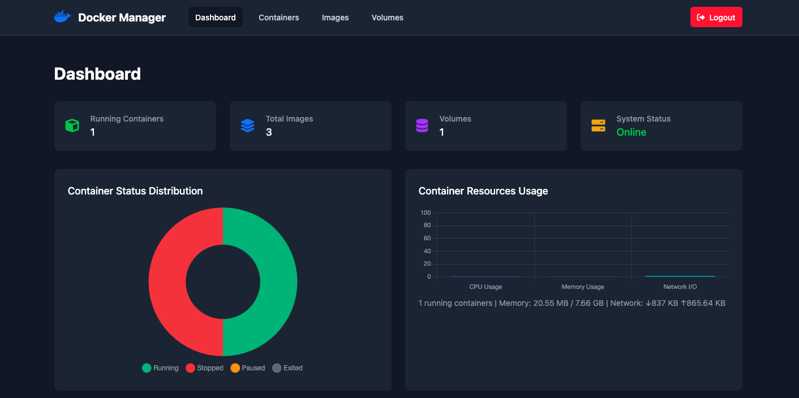

# Docker Manager

A web-based Docker management application that provides real-time monitoring and control of Docker containers, images, and volumes through an intuitive dashboard interface.

<p align="center">
  
</p>

## Technologies

### Backend


### Frontend


### DevOps


## Features

- **Container Management**: Start, stop, restart, and remove Docker containers
- **Image Management**: Pull and remove Docker images
- **Volume Management**: Create and delete Docker volumes
- **Network Management**: Create and delete Docker networks 
- **Compose Management**: Work in progress...
- **Real-time Monitoring**: Live dashboard with container statistics and metrics
- **Authentication**: Secure JWT-based authentication system
- **User Roles**: Admin and read-only user access levels
- **Dashboard Charts**: Visual representation of Docker resource usage
- **WebSocket Integration**: Real-time updates via Socket.IO

## Prerequisites

Before running this application, ensure you have the following installed:

- [Docker](https://docs.docker.com/get-docker/) (version 20.10 or higher)
- [Docker Compose](https://docs.docker.com/compose/install/) (version 2.0 or higher)
- [Node.js](https://nodejs.org/) (version 16 or higher)
- [npm](https://www.npmjs.com/) (comes with Node.js)

## Setup Instructions

1. **Clone the repository**
   ```bash
   git clone <repository-url>
   cd docker_manager_project
   ```

2. **Install dependencies**
   ```bash
   npm install
   ```

3. **Start the PostgreSQL database**
   ```bash
   docker-compose up -d
   ```
   This will create a PostgreSQL container with the database schema automatically initialized.

4. **Configure environment variables**

   The project includes a `.env` file with JWT secrets. You can modify these if needed:
   ```env
   ACCESS_TOKEN_SECRET=your-access-token-secret
   ```

5. **Start the application**

   For development with auto-reload:
   ```bash
   npm run dev
   ```

   For production:
   ```bash
   npm start
   ```

6. **Access the application**

   Open your browser and navigate to:
   ```
   http://localhost:3000
   ```

## Default Credentials

- **Username**: `admin`
- **Password**: `admin123`

## Available Scripts

- `npm start` - Start the production server
- `npm run dev` - Start the development server with nodemon (auto-reload)

## API Endpoints

### Authentication
- `POST /api/auth/login` - User login
- `POST /api/auth/logout` - User logout

### Users
- `GET /api/users` - Get all users (admin only)
- `POST /api/users` - Create new user (admin only)

### Containers
- `GET /api/containers` - List all containers
- `POST /api/containers/:id/start` - Start a container
- `POST /api/containers/:id/stop` - Stop a container
- `POST /api/containers/:id/restart` - Restart a container
- `DELETE /api/containers/:id` - Remove a container

### Images
- `GET /api/images` - List all images
- `POST /api/images/pull` - Pull an image from registry
- `DELETE /api/images/:id` - Remove an image

### Volumes
- `GET /api/volumes` - List all volumes
- `POST /api/volumes` - Create a new volume
- `DELETE /api/volumes/:name` - Remove a volume
- 
- ### Networks
- `GET /api/networks` - List all networks
- `POST /api/networks` - Create a new network
- `DELETE /api/networks/:id` - Remove a network
- `POST /:id/connect` - connect a network to a container

### Health Check
- `GET /health` - Application and Docker connection health status

## Configuration

### Database Configuration

The PostgreSQL database is configured via `docker-compose.yml`:
- **Database**: `docker_manager`
- **User**: `postgres`
- **Password**: `password`
- **Port**: `5432`

To modify these settings, edit the `docker-compose.yml` file.

### Docker Connection

The application connects to Docker via the Docker socket (`/var/run/docker.sock`). Ensure Docker is running on your system.

